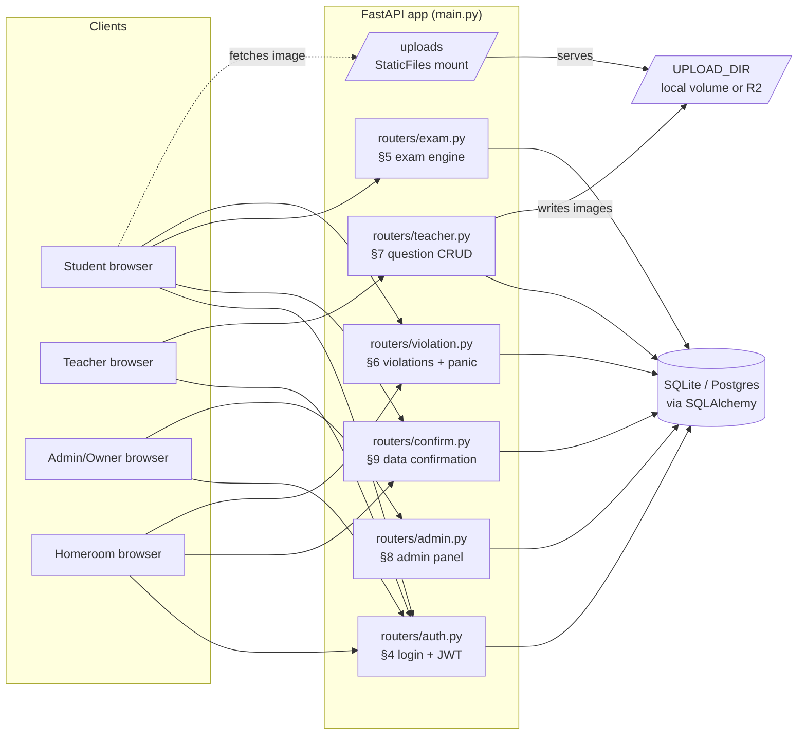
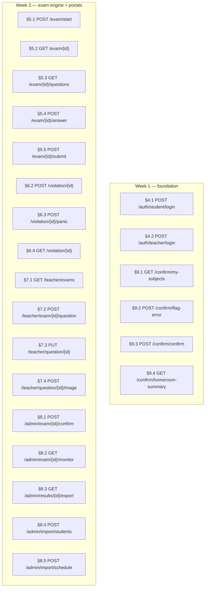
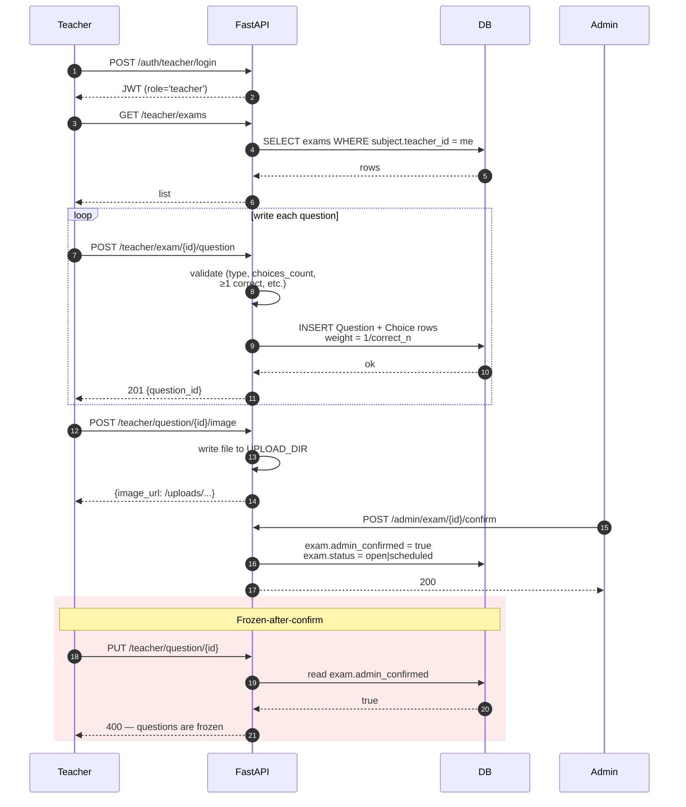
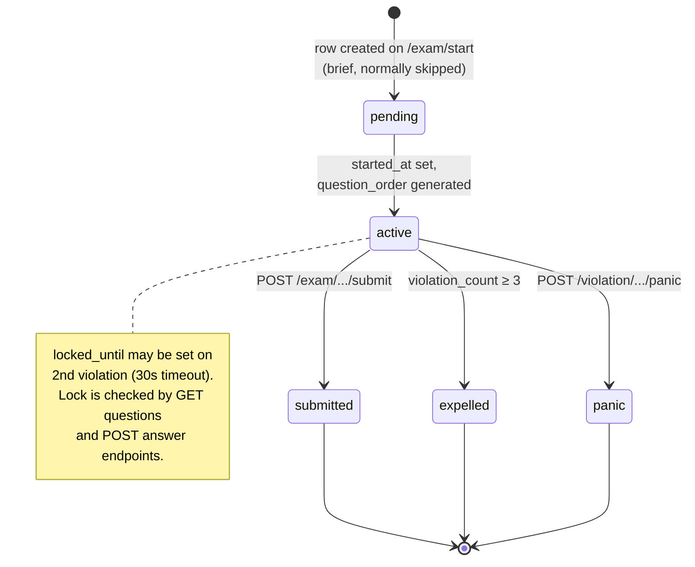
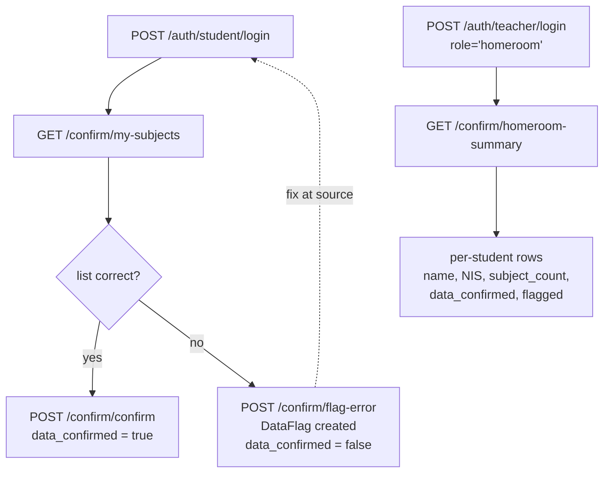

# HADIR Exam App — Flowcharts

Mermaid diagrams of the main flows in this repo. GitHub renders them
inline. Update them whenever a router gains/loses an endpoint or a
state machine changes — they're documentation, not code, and they rot
fast if you don't.

---

## 1. System overview



---

## 2. Endpoint map by spec section



---

## 3. Student exam-day flow (§4 → §5 → §6)

The happy path plus the two terminal branches (panic, expelled).

```mermaid
flowchart TD
    L[POST /auth/student/login] --> L_OK{flagged?}
    L_OK -- yes --> L_BLK[403 — locked out]
    L_OK -- no --> JWT[JWT issued, 8h]

    JWT --> ST[POST /exam/start]
    ST --> ST_C{exam.admin_confirmed<br/>and in window?}
    ST_C -- no --> ST_X[400 — not yet open / closed]
    ST_C -- yes --> SESS[(ExamSession created<br/>status='active'<br/>question_order shuffled)]

    SESS --> Q[GET /exam/{id}/questions]
    Q --> ANS[POST /exam/{id}/answer<br/>repeat per question]
    ANS --> ANS

    ANS --> CHOICE{Student action}
    CHOICE -- normal --> SUB[POST /exam/{id}/submit]
    CHOICE -- tab switch /<br/>fullscreen exit --> VIO[POST /violation/{id}]
    CHOICE -- emergency --> PAN[POST /violation/{id}/panic]

    VIO --> VIO_T{violation_count}
    VIO_T -- 1 --> ANS
    VIO_T -- 2 --> LOCK[locked_until = now+30s]
    LOCK --> ANS
    VIO_T -- ≥3 --> EXP[ExpelledFlag created<br/>status='expelled']

    SUB --> SCORE[score per §1.4<br/>ExamResult written]
    SCORE --> DONE[200 — total/max/percentage]
    PAN --> END_PAN[status='panic']
    EXP --> END_EXP[homeroom notified<br/>via /admin/monitor]
```

---

## 4. Teacher authoring → admin confirm → frozen

This is the handoff that makes the question set tamper-proof during
the exam window. Once the admin confirms, every mutating teacher
endpoint returns 400.



---

## 5. ExamSession state machine



---

## 6. Violation threshold (§6.2)

```mermaid
flowchart LR
    EVT[tab_switch /<br/>fullscreen_exit event] --> POST[POST /violation/{id}]
    POST --> INC[violation_count += 1<br/>SessionViolation row]
    INC --> SW{count?}
    SW -- 1 --> W[200 — warning]
    SW -- 2 --> LCK[locked_until = now+30s<br/>200 — locked]
    SW -- ≥3 --> EXP[status = expelled<br/>ExpelledFlag created<br/>200 — expelled]

    LCK -. blocks .-> Q[GET questions]
    LCK -. blocks .-> ANS[POST answer]
    EXP -. surfaces in .-> MON[GET /admin/monitor]
    EXP -. visible to .-> HR[homeroom teacher<br/>via class_id link]
```

---

## 7. Data confirmation flow (§9)

The pre-exam window where students verify their subject list and the
homeroom teacher reviews the class summary.



---

## 8. Imports / re-imports (§8.4–§8.5)

```mermaid
flowchart LR
    subgraph Source files
        XI[daftar_peserta_kelas_XI.xlsx]
        X[daftar_peserta_kelas_X.xlsx]
        SC[schedule_parsed.csv]
    end

    XI & X --> IS[POST /admin/import/students<br/>?dry_run=true|false]
    SC --> ISC[POST /admin/import/schedule<br/>?dry_run=true|false]

    IS --> PS["parsers.excel.parse_students()<br/>flags dups, NISN length"]
    ISC --> PSC["parsers.excel.parse_schedule()<br/>+ derive_class_subjects()"]

    PS --> DRY1{dry_run?}
    DRY1 -- yes --> R1[return counts + warnings]
    DRY1 -- no --> S1["seed.seed_classes_and_students()"]
    S1 --> DB[(DB)]

    PSC --> DRY2{dry_run?}
    DRY2 -- yes --> R2[return counts + warnings]
    DRY2 -- no --> S2["seed.seed_subjects_and_exams()<br/>+ seed_class_subjects()"]
    S2 --> DB
```
